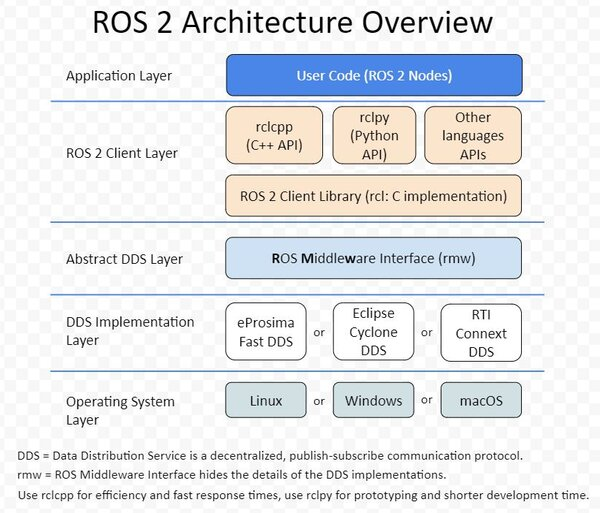

# ROS2架构

1. 操作系统层 驱动硬件、底层网络通信等
2. DDS(Data Distribution Service)数据分发服务 提供节点间的通信机制，支持发布/订阅、服务调用等
3. RMW(Robot Middleware)抽象层 封装DDS实现细节，提供统一的接口供上层使用
4. RCL(Robot Client Library) 提供C++（rclcpp）、Python（rclpy）等语言的API，封装DDS通信细节
5. ROS2核心功能层 提供参数服务器、生命周期管理、日志记录等核心功能
6. ROS2工具层 提供命令行工具（ros2 CLI）、可视化工具（rqt）等
7. ROS2应用层 用户开发的机器人应用程序，利用ROS2提供的功能实现各种机器人任务

中间件 独立的系统软件或服务程序，负责不同组件之间的数据传输和通信。执行中间件的一个关键途径是信息传递。通过中间件，应用程序可以工作于多平台或OS环境。在ROS2中，DDS充当中间件的角色，负责节点间的消息传递和服务调用。

[ROS1 vs ROS2 中间件](./images/ros1-vs-ros2.png)

DDS的优势和不足:

优势：
1. 实时性强：DDS支持高实时性通信，适用于对延迟和确定性有严格要求的机器人系统。
2. 分布式架构：天然支持分布式系统，节点间可直接通信，无需中心服务器，提升系统的可扩展性和鲁棒性。
3. 灵活的QoS（服务质量）机制：可根据应用需求灵活配置可靠性、延迟、持久性等参数，满足不同场景下的通信需求。
4. 支持多种通信模式：包括发布/订阅、请求/响应等，适应多样化的应用需求。
5. 跨平台和多语言支持：可在不同操作系统和编程语言间无缝通信，便于系统集成。
6. 自动发现机制：节点可自动发现网络中的其他节点，简化部署和扩展。

不足：
1. 配置复杂：QoS参数众多，配置不当可能导致通信异常或性能下降，学习和调优门槛较高。
2. 资源消耗较大：部分DDS实现对内存和CPU资源占用较高，不适合资源受限的嵌入式设备。
3. 兼容性问题：不同厂商的DDS实现间存在兼容性差异，可能导致互操作性问题。
4. 调试难度大：分布式和自动发现机制使得问题定位和调试变得复杂。
5. 文档和社区支持有限：相较于其他中间件，部分DDS实现的文档和社区资源较少，遇到问题时难以及时获得帮助。